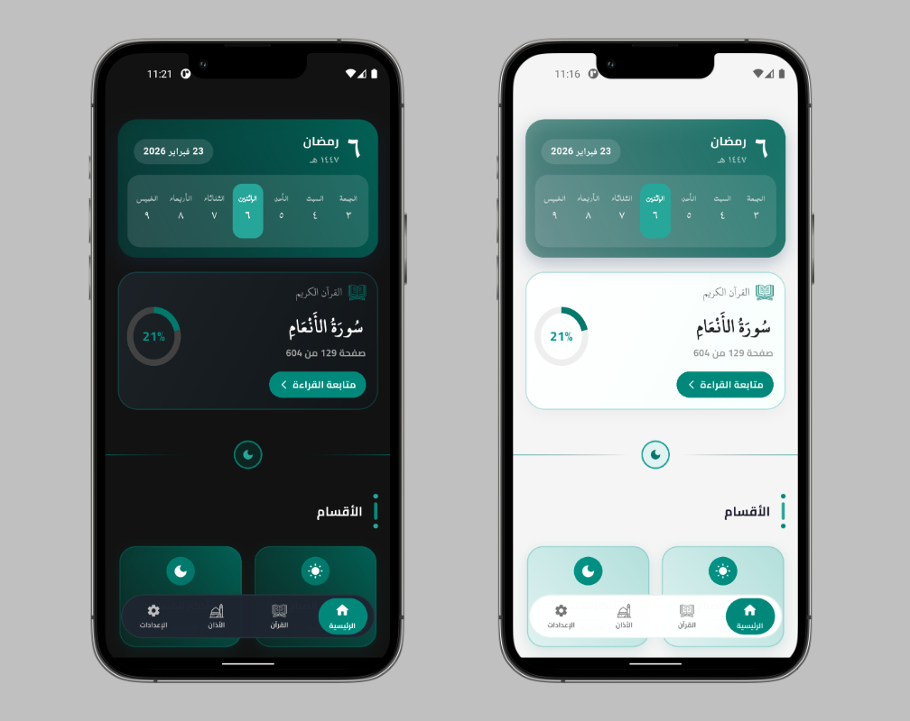
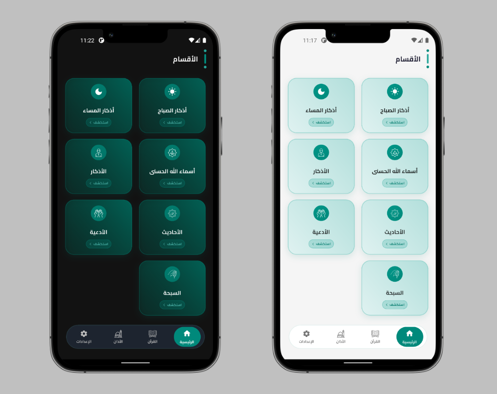
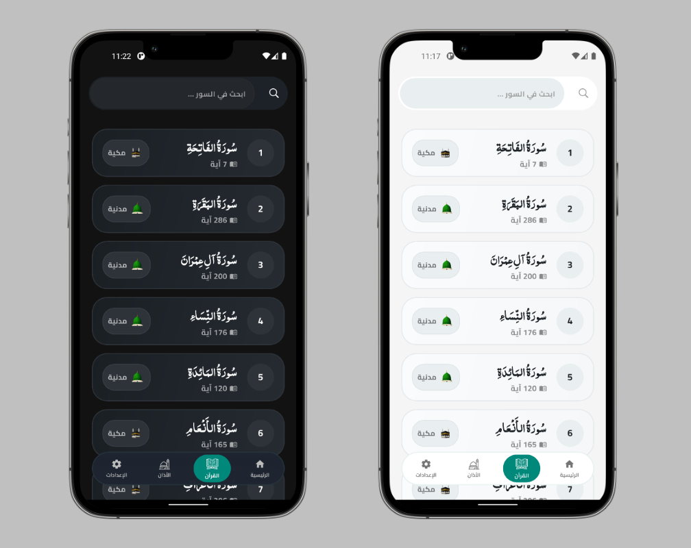
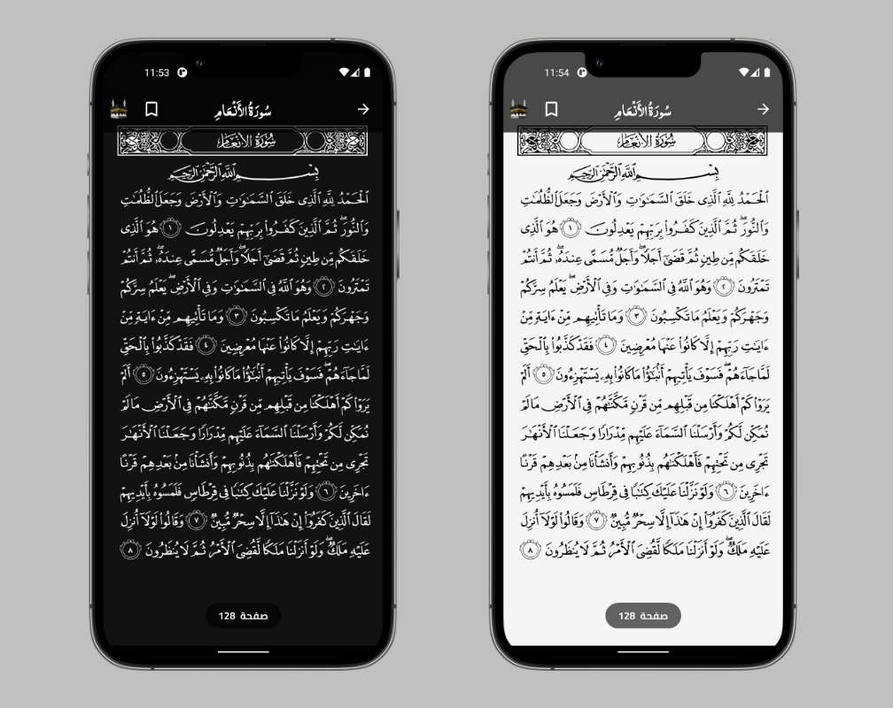
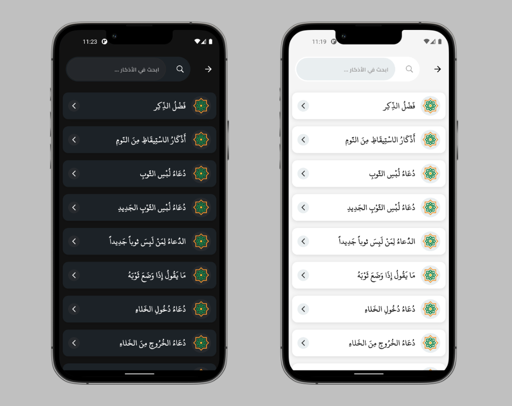
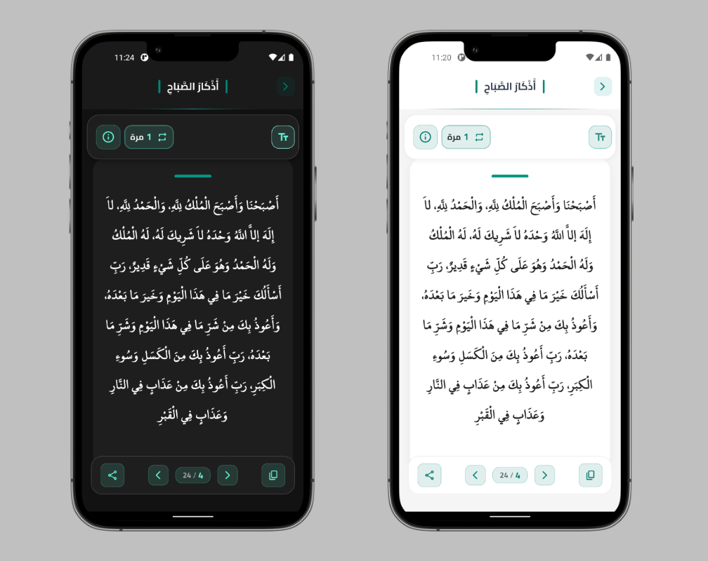
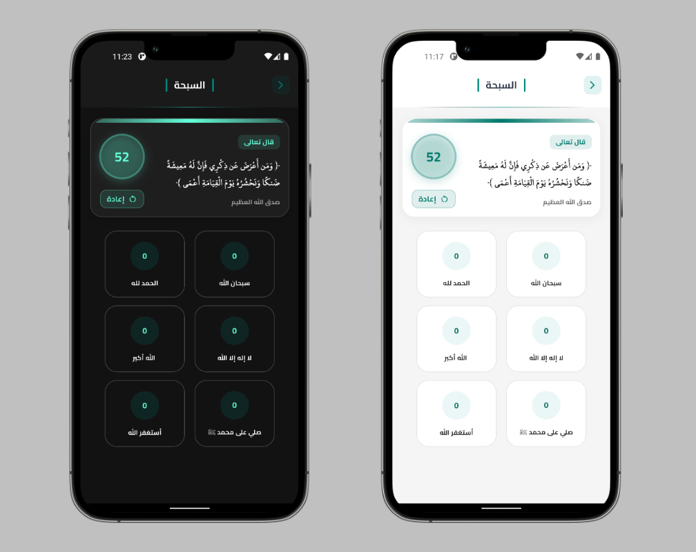
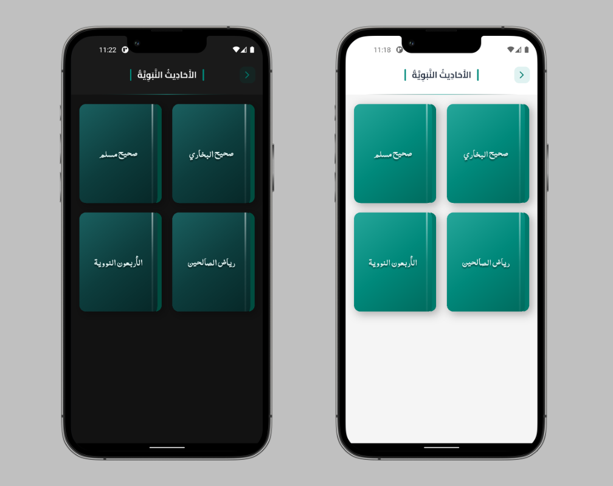
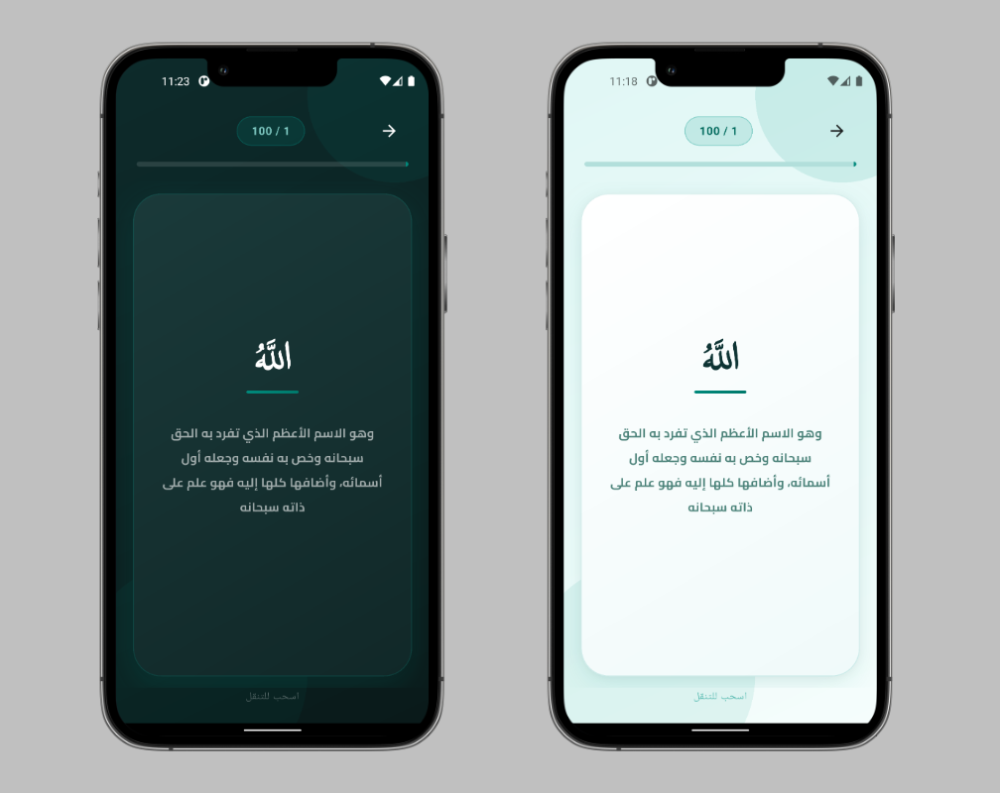
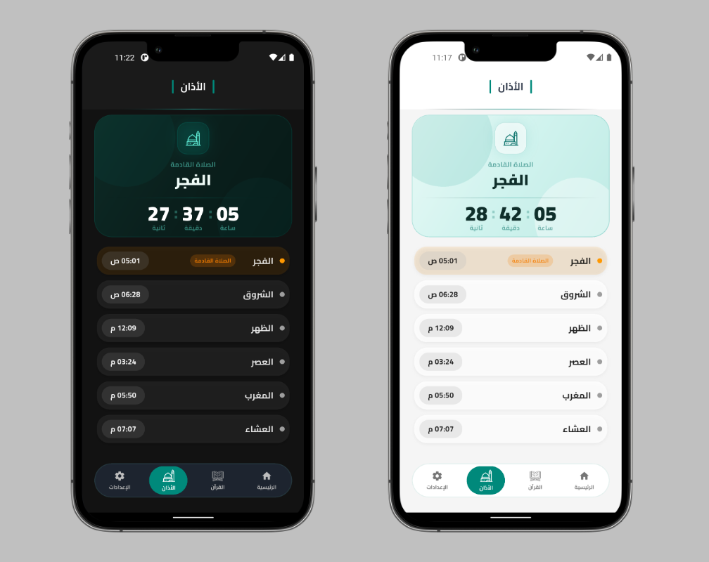

<!-- # hisn_almuslim

A new Flutter project.

## Getting Started

This project is a starting point for a Flutter application.

A few resources to get you started if this is your first Flutter project:

- [Lab: Write your first Flutter app](https://docs.flutter.dev/get-started/codelab)
- [Cookbook: Useful Flutter samples](https://docs.flutter.dev/cookbook)

For help getting started with Flutter development, view the
[online documentation](https://docs.flutter.dev/), which offers tutorials,
samples, guidance on mobile development, and a full API reference. -->

# 🕌 Hisn Al-Muslim
### Islamic Flutter Application

> A comprehensive Islamic mobile application built with Flutter to help Muslims stay consistent with daily worship, remembrance, and spiritual growth.

---

# 📱 App Screenshots

## 🏠 Home

  
  

---

## 📖 Quran

  
  

---

## 🌅 Azkar

  
  

---

## 📿 Tasbeeh

  

---

## 📚 Hadith

  

---

## 🕋 Names of Allah

  

---

## 🕌 Adhan & Notifications

  

## 
---

# ✨ Features

## 📖 Quran
- Full Quran display
- Surah listing
- Smooth navigation between Surahs
- Clean Arabic typography
- Dark & Light mode support

## 🌅 Azkar
- Morning Azkar
- Evening Azkar
- Organized categories
- Detailed Zikr screen
- Easy reading interface

## 🤲 Duas
- Collection of Islamic supplications
- Organized and easy to access

## 📚 Hadith
- Selected authentic Hadith
- Simple and clean reading layout

## 📿 Digital Tasbeeh
- Smart counter
- Easy reset
- Helps track daily dhikr

## 📊 Daily Wird Tracker
- Track your daily reading progress
- Motivates consistency
- Reminder notifications

## 🔔 Notifications
- Morning Azkar reminders
- Evening Azkar reminders
- Daily Wird reminders
- Local notification support

## 🌙 Theme Support
- Dark Mode
- Light Mode
- Smooth theme switching

## 🕋 Asma’ Allah Al-Husna
- 99 Names of Allah
- Clean UI
- Easy navigation

## 📅 Hijri Calendar
- Islamic Hijri date support
- Integrated with the app design

---

# 🛠 Built With

- Flutter
- Dart
- Local Notifications
- Shared Preferences
- Clean UI Architecture

---

# 📂 Project Structure
